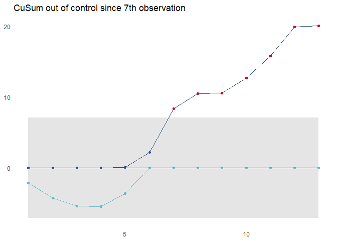
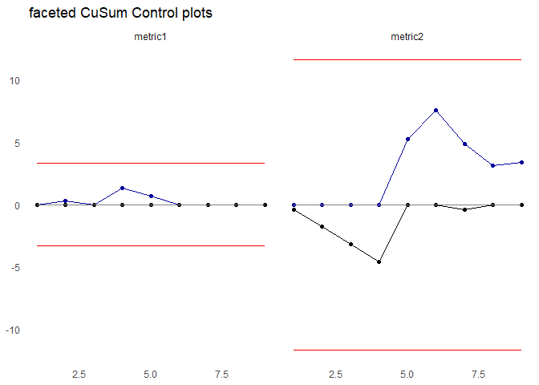

<!-- README.md is generated from README.Rmd. Please edit that file -->

# cusumcharter

<!-- badges: start -->

[](https://github.com/johnmackintosh/cusumcharter/actions)

[](https://codecov.io/gh/johnmackintosh/cusumcharter?branch=master)

[](https://github.com/johnmackintosh/cusumcharter/actions/workflows/render-readme.yaml)

[](https://lifecycle.r-lib.org/articles/stages.html#experimental)
[](https://CRAN.R-project.org/package=cusumcharter)
<!-- badges: end -->

The goal of cusumcharter is to create both simple CuSum charts, with and
without control limits from a vector, or to create multiple CuSum
charts, with or without control limits, from a grouped dataframe, tibble
or data.table

## Installation

Install the development version from [GitHub](https://github.com/) with:

``` r
# install.packages("remotes")
remotes::install_github("johnmackintosh/cusumcharter")
```

## A Simple CuSum calculation

This returns the CuSum statistics for a single vector, centred on a
supplied target value:

``` r
library(cusumcharter)
test_vec <- c(0.175, 0.152, 0.15, 0.207, 0.136, 0.212, 0.166)

CuSum_res <- cusum_single(test_vec, target = 0.16)
CuSum_res
#> [1] 0.175 0.167 0.157 0.204 0.180 0.232 0.238
```

## Expanded outputs with cusum\_single\_df

This function takes a single vector as input and returns a data.frame
with additional information used to calculate the CuSum statistic

``` r
test_vec2 <- c(1,1,2,11,3,5,7,2,4,3,5)
cusum_single_df(test_vec2)
#>     x target si cusumx cusum_target
#> 1   1      4 -3     -3            1
#> 2   1      4 -3     -6           -2
#> 3   2      4 -2     -8           -4
#> 4  11      4  7     -1            3
#> 5   3      4 -1     -2            2
#> 6   5      4  1     -1            3
#> 7   7      4  3      2            6
#> 8   2      4 -2      0            4
#> 9   4      4  0      0            4
#> 10  3      4 -1     -1            3
#> 11  5      4  1      0            4
```

## CuSum control limits

Two additional functions allow you to calculate control limits from a
single vector and plot a CuSum chart with control limits. This is for a
single vector and one chart at a time.

``` r
test_vec3 <- c(1,1,2,3,5,7,11,7,5,7,8,9,5)
controls <- cusum_control(test_vec3, target = 4)
controls
#>     x target variance std_dev cusum      cplus      cneg cum_nplus cum_nneg
#> 1   1      4       -3 1.77305    -3  0.0000000 -2.113475         0        1
#> 2   1      4       -3 1.77305    -6  0.0000000 -4.226950         0        2
#> 3   2      4       -2 1.77305    -8  0.0000000 -5.340426         0        3
#> 4   3      4       -1 1.77305    -9  0.0000000 -5.453901         0        4
#> 5   5      4        1 1.77305    -8  0.1134752 -3.567376         1        5
#> 6   7      4        3 1.77305    -5  2.2269504  0.000000         2        0
#> 7  11      4        7 1.77305     2  8.3404255  0.000000         3        0
#> 8   7      4        3 1.77305     5 10.4539007  0.000000         4        0
#> 9   5      4        1 1.77305     6 10.5673759  0.000000         5        0
#> 10  7      4        3 1.77305     9 12.6808511  0.000000         6        0
#> 11  8      4        4 1.77305    13 15.7943262  0.000000         7        0
#> 12  9      4        5 1.77305    18 19.9078014  0.000000         8        0
#> 13  5      4        1 1.77305    19 20.0212766  0.000000         9        0
#>         ucl       lcl centre obs
#> 1  7.092199 -7.092199      0   1
#> 2  7.092199 -7.092199      0   2
#> 3  7.092199 -7.092199      0   3
#> 4  7.092199 -7.092199      0   4
#> 5  7.092199 -7.092199      0   5
#> 6  7.092199 -7.092199      0   6
#> 7  7.092199 -7.092199      0   7
#> 8  7.092199 -7.092199      0   8
#> 9  7.092199 -7.092199      0   9
#> 10 7.092199 -7.092199      0  10
#> 11 7.092199 -7.092199      0  11
#> 12 7.092199 -7.092199      0  12
#> 13 7.092199 -7.092199      0  13
```

## CuSum Control Chart

``` r
test_vec3 <- c(1,1,2,3,5,7,11,7,5,7,8,9,5)
controls <- cusum_control(test_vec3, target = 4)
cusum_control_plot(controls, do_facet = FALSE, title_text = "sample CuSum with controls shows out of control since 7th observation")
```



## Multiple CuSum Control Charts

``` r
library(data.table)
library(cusumcharter)

testdata <- data.frame(
  stringsAsFactors = FALSE,
  N = c(1L,2L,1L,3L,1L,1L,1L,1L,1L,
        2L,1L,1L,1L,10L,7L,2L,3L,5L),
  metric = c("metric1","metric1","metric1","metric1","metric1",
           "metric1","metric1","metric1","metric1","metric2",
           "metric2","metric2","metric2","metric2","metric2",
           "metric2","metric2","metric2"))

testlist <- split(testdata$N,testdata$metric)

testres <- lapply(testlist, cusumcharter::cusum_control)
#> no target value supplied, so using the mean of x
#> no target value supplied, so using the mean of x

testres <- data.table::rbindlist(testres,fill = TRUE, idcol = TRUE)

p <- cusum_control_plot(testres, do_facet = TRUE, title_text = " faceted CuSum Control plots")
p
```



## Planned functionality

1.  CuSums for single vector with no control limits

2.  CuSum for single vector with control limits

3.  CuSums for multiple groups from dataframe, with no control limits

4.  CuSums for multiple groups from dataframe, with control limits
